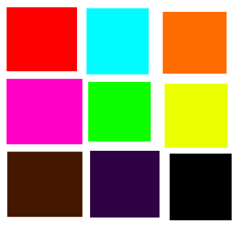

# Open Color Directory (.ocd)

An open source color palette format to make the world a more colorful and happier place.

## Specification

View the [.ocd specification](ocd-spec.md) for information on the file format. It's [simple](examples/simple.ocd)! Trust me!

## Intentions and Goals

### Sharing

Store your palettes in npm prefixed with `ocd-` to easily share and find new palettes.

### Tooling

Bring better color palette and color management tooling to Node and the web. It was designed to use JSON for a reason!

### Palette Conventions

If there is a convention for creating palettes, then it would be easy to swap out palettes and see how different themes would look.

### Management

This allows for better management of palettes through versioning. If you are maintaining a color palette and want to make a drastic change, bump the major version. That way, nobody will freak out that you broke everything when you want your palette to take a radical new direction. You rebel you!

### Cohesion

Use a single palette throughout your projects to keep consistent branding. Update the palette easily when changes are made upstream.
